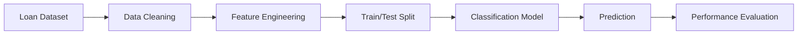

# 💰 Loan Approval Prediction

> **A machine learning classification project that predicts whether a loan application is likely to be approved based on applicant information and financial attributes.**

<p align="center">


</p>

---

# 📖 Overview

**Loan Approval Prediction** is a supervised machine learning project that predicts whether a loan application is likely to be approved using applicant demographic and financial information.

The project demonstrates a complete machine learning workflow, including data preprocessing, exploratory data analysis (EDA), feature engineering, model training, and performance evaluation. It highlights how classification algorithms can support decision-making in financial services.

---

# 🎯 Objectives

* Predict loan approval outcomes using historical data.
* Explore feature relationships that influence loan decisions.
* Compare classification models and evaluate performance.
* Demonstrate an end-to-end machine learning pipeline.

---

# ✨ Key Features

* 📊 Data preprocessing and cleaning
* 🔍 Exploratory Data Analysis (EDA)
* 🧹 Feature engineering
* 🤖 Supervised machine learning classification
* 📈 Model evaluation
* 📓 Jupyter Notebook implementation
* 🔄 Reproducible workflow

---

# 🏗 Machine Learning Pipeline



---

# 🛠 Technology Stack

| Category             | Technology          |
| -------------------- | ------------------- |
| Programming Language | Python              |
| Machine Learning     | Scikit-learn        |
| Data Analysis        | Pandas              |
| Numerical Computing  | NumPy               |
| Visualization        | Matplotlib, Seaborn |
| Development          | Jupyter Notebook    |

---

# 📂 Project Structure

```text
Project of LoanApproval Prediction/

├── LoanApprovalPrediction.ipynb
├── dataset.csv
└── README.md
```

---

# 🚀 Installation

Clone the repository

```bash
git clone https://github.com/sajidrehman2/Data-science-and-Machine-learning-project.git
```

Navigate to the project

```bash
cd "Project of LoanApproval Prediction"
```

Install dependencies

```bash
pip install pandas numpy scikit-learn matplotlib seaborn notebook
```

Launch Jupyter Notebook

```bash
jupyter notebook
```

Open

```text
LoanApprovalPrediction.ipynb
```

---

# 📊 Machine Learning Workflow

* Data collection
* Data cleaning
* Handling missing values
* Feature encoding
* Feature scaling (if required)
* Model training
* Model evaluation
* Prediction

---

# 📋 Example Input Features

Typical features used in loan approval prediction include:

* Applicant Income
* Co-applicant Income
* Loan Amount
* Loan Term
* Credit History
* Property Area
* Education
* Marital Status
* Employment Status

> The exact features depend on the dataset included in this project.

---

# 📈 Applications

* Banking
* Financial technology (FinTech)
* Credit risk assessment
* Loan eligibility screening
* Decision support systems

---

# 🚧 Future Improvements

* Hyperparameter tuning
* Model comparison dashboard
* Feature importance visualization
* SHAP explainability
* Streamlit web application
* FastAPI REST API
* Docker deployment
* Cloud deployment

---

# 🤝 Contributing

Contributions are welcome.

Feel free to fork the repository, improve the project, and submit pull requests.

---

# 👨‍💻 Author

**Sajid Rehman**

**AI & Data Science Engineer**

Areas of Interest:

* Machine Learning
* Data Science
* Artificial Intelligence
* Predictive Analytics
* Python Development

GitHub: **https://github.com/sajidrehman2**

---

# ⭐ Support

If you found this project useful, consider giving it a **Star ⭐**. Your support helps others discover the project and encourages future improvements.
